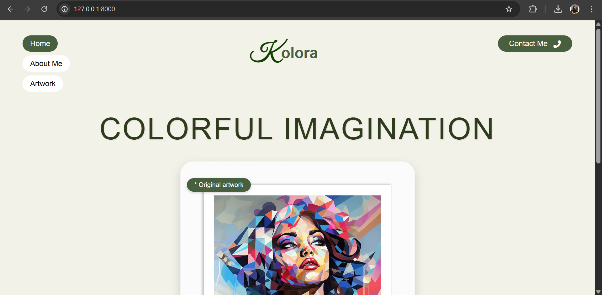
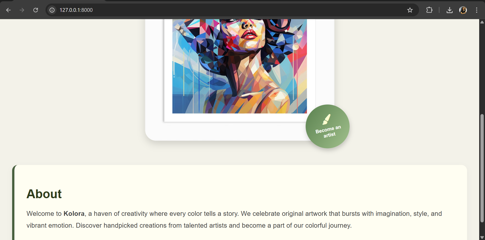
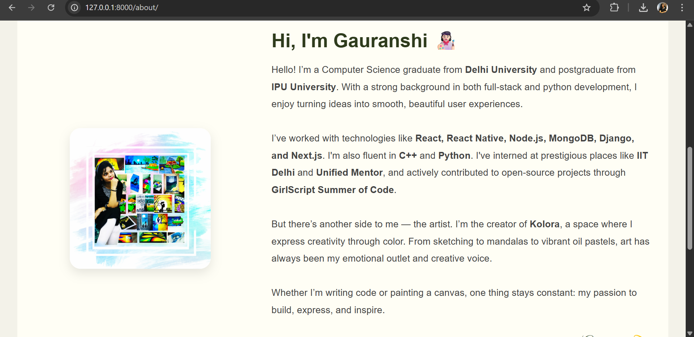
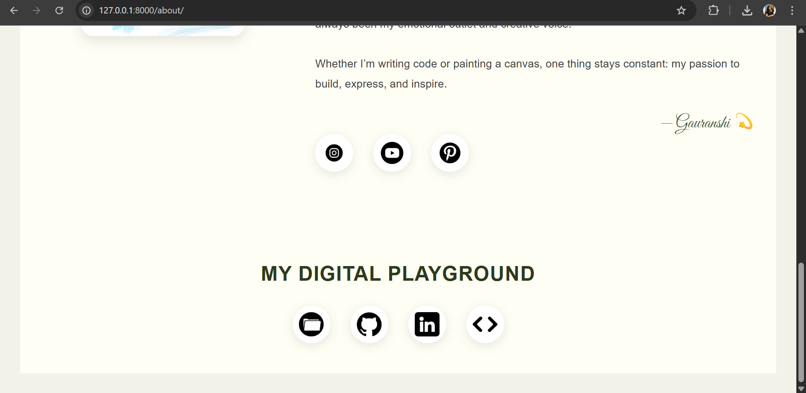
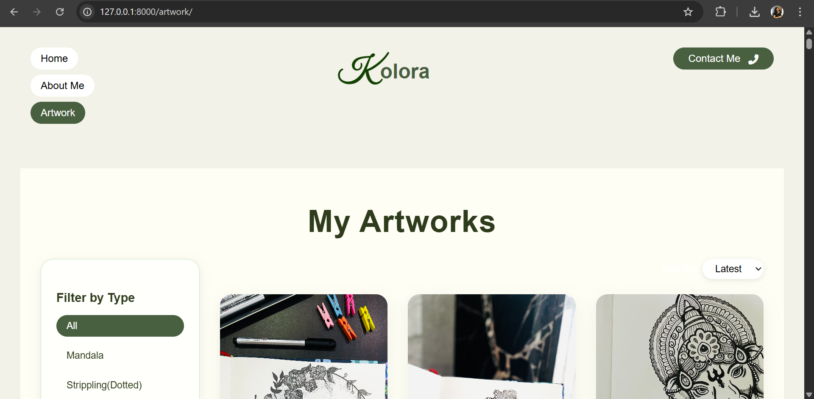
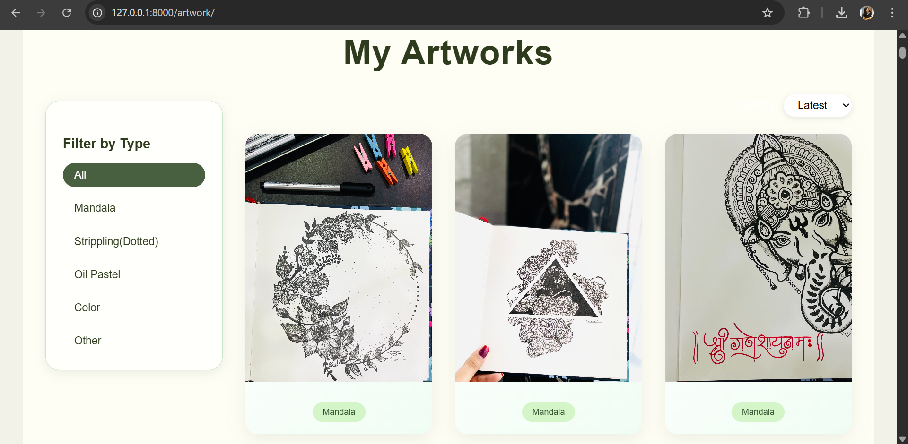
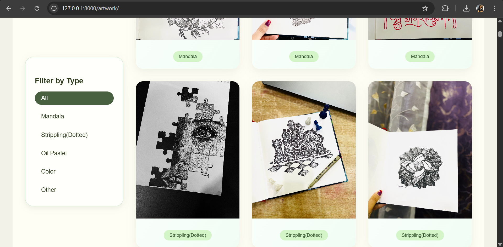
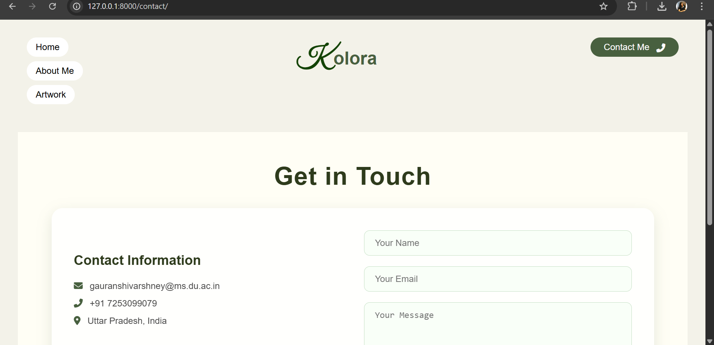
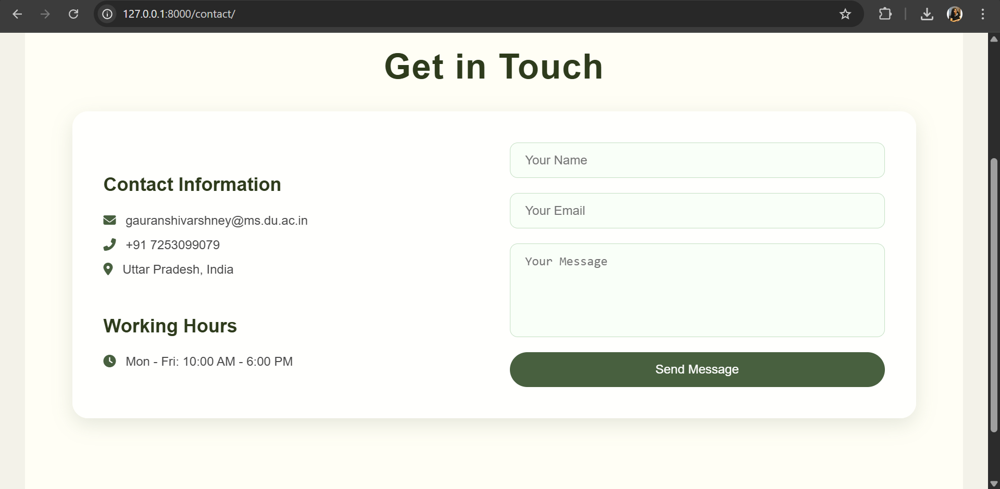

# 🎨 Gauranshi's Art Website

A personal website blending creativity — showcasing artwork and development projects. Built using **Django** and styled for an elegant, professional presence online.

---

## 🔗 Live Demo

[👉 View Link ](https://art-website-gprz.onrender.com)

---

## 🌟 Features

- ✨ Clean "About Me" section with dual persona (Artist + Developer)
- 🎨 Instagram, Pinterest, and YouTube art profile integration
- 💻 GitHub, LinkedIn, LeetCode, and Portfolio links
- 📷 Gallery-ready (image upload support via media folder)
- ⚡ Fast, mobile-responsive UI
- ☁️ Deployed on Render

---

## 🛠️ Tech Stack

- **Backend:** Django (Python)
- **Frontend:** HTML, CSS (custom, with responsive layout)
- **Database:** SQLite (for local), PostgreSQL (recommended for production)
- **Deployment:** Render
- **Static/Media Handling:** `whitenoise`, `staticfiles`, Django `media/` folder

---

## Screenshots

To provide a better understanding of the Student Study Portal application, here is a screenshot:

##Home Interface

##About Interface

##Art Interface

##Contact Interface

